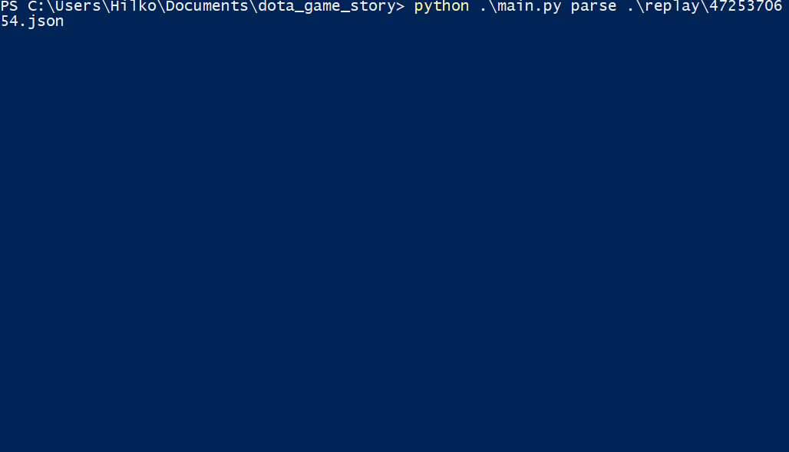

# DotA Game Story
The purpose of this repository is to convert a replay file into a "readable" story.
This is rather a proof of concept because the implementation of different events is not extensive.

## How does it work?
The concept consists of three different elements

1. ReplayWindow
The ReplayWindow is a slice of the whole replay and contains only information for a given time frame (e.g. 5 seconds). Instead of parsing the whole replay at once, ReplayWindows can help to detect interesting events within the game. One example for this can be team fights. If the number of kills within a ReplayWindow is comparably high, this ReplayWindow is propably interesting for the game development. Additionally, ReplayWindows can overlap, so that important events cannot fall between two ReplayWindows.

2. TextCondition
A text condition is a tuple which consists of two elements: One condition and one text block. If the condition results in true, than the text block can be used for the game story. Look at the following example:
`` TextCondition('action == \'KILLED\' and killinfo[2].startswith(\'npc_dota_hero\')', '[{0}] {3} kills {4}.')``
This text condition checks if the event was a kill and if the object which has been killed is a hero. If this is the case, then the string "[{0}] {3} kills {4}." can be used for the final story. {3} gets replaced with the murderer and {4} with the hero which has been killed.

3. StoryTeller
The story teller is the main element and brings together the previous two elements. It generates the replay windows and checks them against the conditions.

## Example

## FAQ
#### *Why don't you parse the game replay files line after line but you use ReplayWindows?*

Not every game event is one line in the game replay file, e.g. for the smoking event every player gets smoked idividually:

``{"time":681,"type":"DOTA_COMBATLOG_MODIFIER_ADD","value":0,"attackername":"npc_dota_hero_phoenix","targetname":"npc_dota_hero_phoenix","sourcename":"npc_dota_hero_naga_siren","targetsourcename":"dota_unknown","attackerhero":true,"targethero":true,"attackerillusion":false,"targetillusion":false,"inflictor":"modifier_smoke_of_deceit"}
{"time":681,"type":"DOTA_COMBATLOG_MODIFIER_ADD","value":0,"attackername":"npc_dota_hero_phoenix","targetname":"npc_dota_hero_batrider","sourcename":"npc_dota_hero_naga_siren","targetsourcename":"dota_unknown","attackerhero":true,"targethero":true,"attackerillusion":false,"targetillusion":false,"inflictor":"modifier_smoke_of_deceit"}
``

To combine both events the ReplayWindow can be used.

#### *How to convert my replay .dem files to the required jsonlines file?*

Just use [Parser Project](https://github.com/odota/parser) from Opendota. Rename the resulting json file to xxx.jsonlines and you can use it :)

### *How to use this project?**
1. Clone it
2. Run `pipenv shell`
3. Run `python main.py initdb` which initiates the TextCondition database
4. Run `python main.py parse xxx.json` with xxx.json being your replay file as jsonlines.

## ToDo
* Include more events to make a real story
* Aggregate overlapping ReplayWindwos
